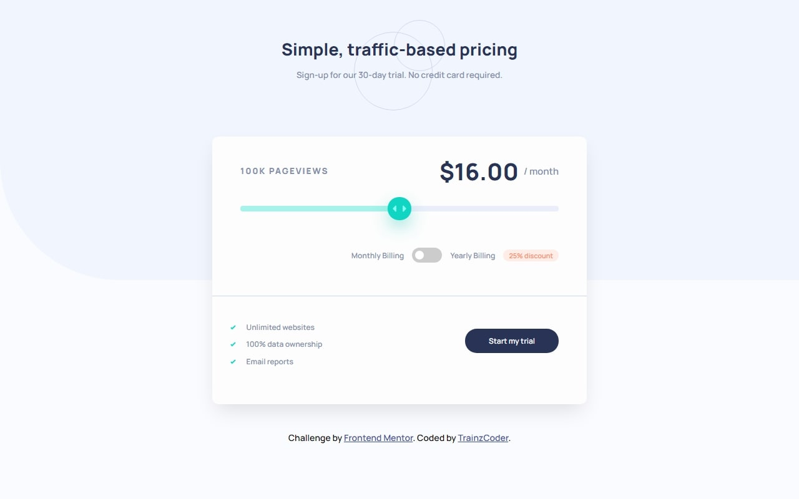

# Frontend Mentor - Interactive pricing component solution

This is a solution to the [Interactive pricing component challenge on Frontend Mentor](https://www.frontendmentor.io/challenges/interactive-pricing-component-t0m8PIyY8). Frontend Mentor challenges help you improve your coding skills by building realistic projects.

# Screenshot

### Links

- See in live [here](https://interactive-pricing-trz.netlify.app)

### Built with

- Semantic HTML5 markup
- CSS custom properties
- Flexbox
- CSS Grid

# Author

- Frontend Mentor - [@trainzCoder](https://www.frontendmentor.io/profile/trainzCoder)
